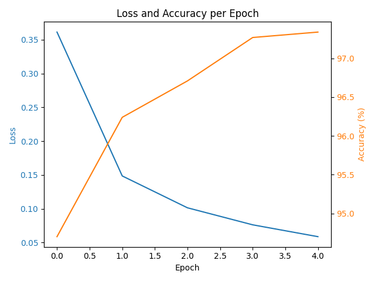
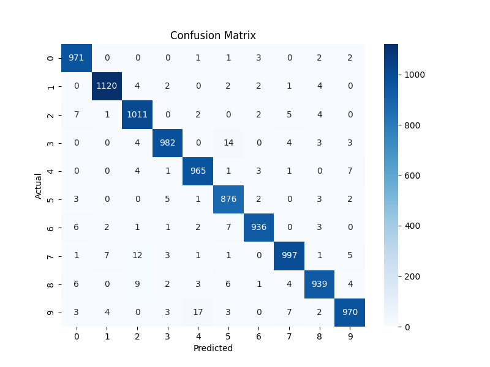

# MNIST-Digit-Classifier-PyTorch
This is a simple neural network built with PyTorch that classifies handwritten digits from the classic MNIST dataset.

While this is a common "beginner" project, it’s part of my practical learning journey as a student of Applied Artificial Intelligence at IU University.  
I wrote this project line by line, with the goal of not just getting it to work, but truly understanding each step – from data loading, to backpropagation, to performance visualization.

---

## What the model does

- Loads the MNIST dataset of 28x28 grayscale images (digits 0–9)
- Defines a fully connected neural network using `torch.nn`
- Trains the model using Adam optimizer and CrossEntropy loss
- Evaluates performance after each epoch
- Visualizes accuracy, loss, and confusion matrix

---

## Model Architecture

- Input Layer: 784 neurons (28x28 pixels flattened)
- Hidden Layer 1: 128 neurons + ReLU
- Hidden Layer 2: 64 neurons + ReLU
- Output Layer: 10 neurons (for digits 0–9)
- Visualizes accuracy, loss, and confusion matrix

---

## How to run the project

1. Clone the repository:
git clone https://github.com/karata-ai/MNIST-Digit-Classifier-PyTorch
cd MNIST-Digit-Classifier-PyTorch

2. Install the dependencies:
pip install -r requirements.txt

3. Run the training script:
python train.py

4. (Optional) To see a sample image from the dataset:
python datavisualised.py

---

## Results

After 5 epochs, the model reaches approximately 97% accuracy on the test dataset.

### Loss and Accuracy per Epoch

### Confusion Matrix

The matrix below shows the number of correct and incorrect predictions for each digit:

---

## Notes from the author

I'm a student building my foundation in AI.  
Even though this project is small, I focused on learning the core concepts:
- What happens in each part of the training loop
- How tensors flow through layers
- How backpropagation works under the hood
- How to interpret model performance, not just print accuracy

---

## Technologies used

- Python
- PyTorch
- torchvision
- matplotlib
- seaborn
- scikit-learn
